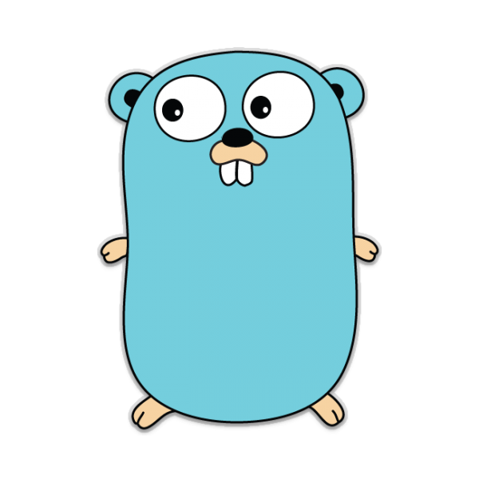
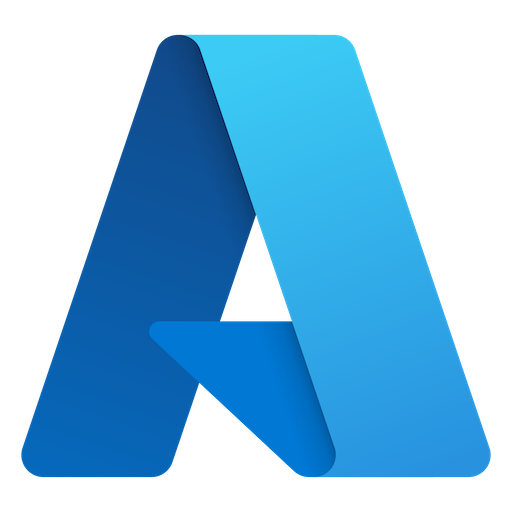

# Hi there, I'm Jun Kin 👋 

MAINTENANCE

## What am I doing?

- 🌉 Building out cloud platform infrastructure @ [AWS](https://aws.com)
- 🔐 Ensuring security on systems in zero-trust environments
- 🌱 I’m currently learning everything about system design 🤣
- 🎉 Creating self-hosting service for family using kubernetes
- ⚡ Codify **_ALL OF THE THINGS_**
- 💬 Ask me about anything about homelab, self-hosting service, infrastructure (cloud/on-prem) and kubernetes

### Preferred Working Environment

[][vscode]
[][ohmyzsh]
[][wsl2]

 
 
 

### DevSecOps Tooling

[][ansible]
[][terraform]
[][k8s]
[][docker]
[][podman]

 
 
 

### Languages (Primary)

[][bash]
[][python]

 
 
 

### Languages (Secondary)

[][golang]

 
 
 

### Applications and Services

[][github]
[][atlassian]
[][jenkins]
[][sonarqube]
[][artifactory]

 
 
 

### Cloud Experience

[][aws]
[][azure]

 
 
 

### Baremetal Hypervisors

[][proxmox]

 
 
 

### Connect with me

[][linkedin]
[][email]

 
 

---
###### Want your own personalized Github Readme? [codeSTACKr has an excellent YouTube video tutorial here](https://www.youtube.com/watch?v=ECuqb5Tv9qI) which will help get you started!

<!-- Personal Information -->
[website]:  https://me.cloudjur.com
[linkedin]: https://www.linkedin.com/in/chaijunkin/
[email]:    mailto:chaijunkin@gmail.com

<!-- Preferred Tools -->
[vscode]:   https://code.visualstudio.com
[ohmyzsh]:  https://ohmyz.sh/
[wsl2]:     https://learn.microsoft.com/en-us/windows/wsl/install

<!-- DevSecOps Tooling -->
[ansible]:      https://www.ansible.com/
[terraform]:    https://www.terraform.io/
[k8s]:          https://kubernetes.io/
[docker]:       https://www.docker.com/
[podman]:       https://podman.io/

<!-- Cloud Providers -->
[aws]:    https://aws.amazon.com/
[gcloud]: https://cloud.google.com/
[azure]:  https://azure.microsoft.com/en-us/
[do]:     https://www.digitalocean.com/

<!-- Applications and Services -->
[librenms]:     https://www.librenms.org/
[freeipa]:      https://www.freeipa.org/page/Main_Page
[vault]:        https://www.vaultproject.io/
[github]:       https://github.com/
[gitlab]:       https://gitlab.com/
[rc]:           https://rocket.chat/
[atlassian]:    https://www.atlassian.com/
[artifactory]:  https://jfrog.com/artifactory/
[jenkins]:      https://www.jenkins.io/
[sonarqube]:    https://www.sonarqube.org/
[nexus-oss]:    https://www.sonatype.com/nexus/repository-oss

<!-- Languages -->
[bash]:     http://git.savannah.gnu.org/cgit/bash.git/
[golang]:   https://golang.org/
[python]:   https://www.python.org/
[ruby]:     https://www.ruby-lang.org/en/

<!-- Hypervisors -->
[esxi]:     https://www.vmware.com/products/esxi-and-esx.html
[proxmox]:  https://proxmox.com/en/
[ovirt]:    https://www.ovirt.org/